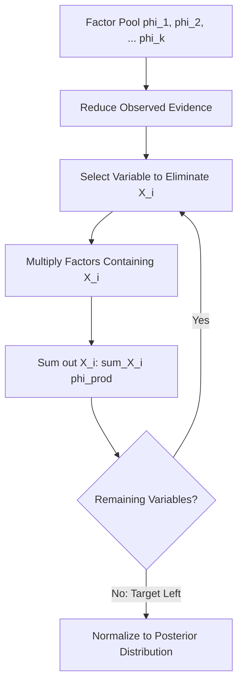

# GenPark Bayesian Network Exact Variable Elimination Skill

Exact probabilistic inference for discrete Bayesian networks utilizing factor products, evidence reduction, and variable elimination.

Find out more at [GenPark](https://genpark.ai) and the [GenPark MCP Catalog](https://genpark.ai/mcp).

## Features
- General discrete multidimensional factor operations.
- Exact posterior computation without Monte Carlo sampling variance.
- Pure Python standard library.
